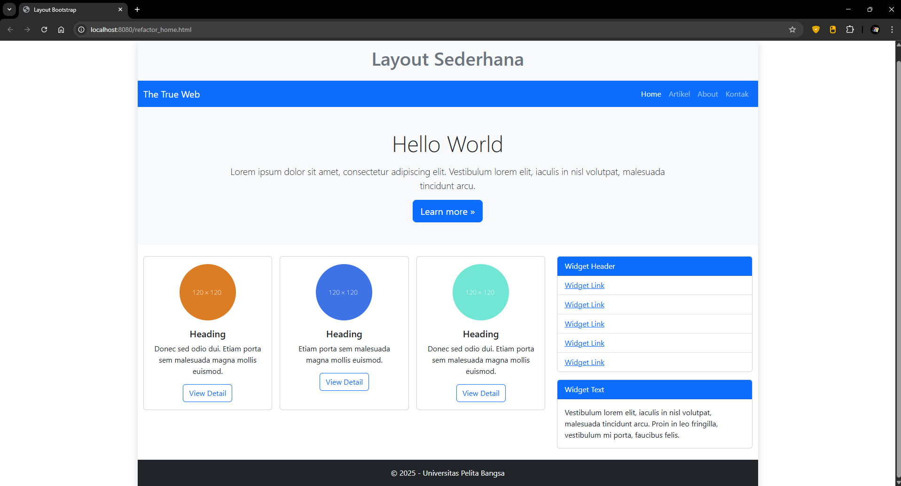
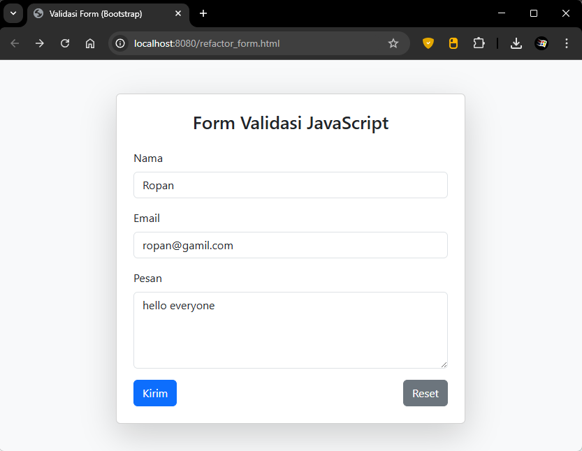
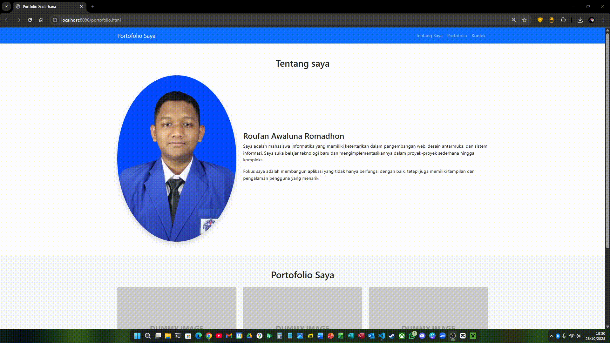

# Lab6Web

- Nama : Roufan Awaluna Romadhon
- NIM : 31240423
- Kelas : TI.24.A.3

---

## Deskripsi

Tugas ini untuk mendesain ulang layout web di pratikum4 dan form di praktikum5 menggunakan twitter bootstrap, serta membuat portofolio menggunakan twitter bootstrap.

## Pertanyaan dan Tugas

```txt
1. Refactor Layout Praktikum 4
    Ambil layout web sederhana dari Praktikum 4. Buat ulang layout tersebut menggunakan
    Bootstrap Grid System.
    ○ Gunakan <nav> Bootstrap untuk bagian navigasi
    ○ Gunakan class .row dan .col-md-8 untuk main content dan .col-md-4 untuk sidebar
    ○ Gunakan komponen .card Bootstrap untuk menggantikan .widget-box
    ○ Gunakan komponen .card untuk menggantikan .box (bagian "Heading" yang berisi 3
    kolom)
    ○ Anda tidak diperbolehkan menggunakan CSS float atau clear manual.

2. Refactor Form Praktikum 5
    Ambil salah satu form dari Praktikum 5 (misalnya Form Input 23atau Form Button 24).
    Buat ulang form tersebut agar terlihat rapi menggunakan class-class form Bootstrap (.form-
    control, .form-label, .btn).

3. Tugas: Buat Halaman Portfolio Sederhana
    Buat satu halaman HTML baru (portfolio.html) menggunakan Bootstrap yang berisi:
    a. Sebuah Navbar di bagian atas.
    b. Sebuah section "Tentang Saya" di dalam .container dengan 1 baris (.row) dan 2 kolom
    (.col):
    * Kolom kiri (.col-md-4) berisi foto Anda (gunakan  dengan class .img-fluid).
    * Kolom kanan (.col-md-8) berisi nama dan deskripsi diri Anda.
    c. Sebuah section "Portfolio Saya" di dalam .container dengan 1 baris (.row) dan 3 kolom
    (.col-md-4):
    * Setiap kolom berisi satu komponen .card yang merepresentasikan satu proyek (beri
    gambar dummy dan deskripsi singkat).
```

## Jawab

### 1. Refactor Layout Praktikum 4

Berikut kode yang sudah menggunakan twitter bootstrap

```html
<!DOCTYPE html>
<html lang="en">
<head>
    <meta charset="UTF-8">
    <meta name="viewport" content="width=device-width, initial-scale=1.0">
    <title>Layout Bootstrap</title>
    <link href="https://cdn.jsdelivr.net/npm/bootstrap@5.3.3/dist/css/bootstrap.min.css" rel="stylesheet">
</head>
<body>
    <div class="container shadow mt-4 p-0">

        <header class="bg-light py-3 text-center">
            <h1 class="text-secondary">Layout Sederhana</h1>
        </header>

        <nav class="navbar navbar-expand-lg navbar-dark bg-primary">
            <div class="container-fluid">
                <a class="navbar-brand" href="#">The True Web</a>
                <button class="navbar-toggler" type="button" data-bs-toggle="collapse" data-bs-target="#navbarNav">
                    <span class="navbar-toggler-icon"></span>
                </button>
                <div class="collapse navbar-collapse" id="navbarNav">
                    <ul class="navbar-nav ms-auto">
                        <li class="nav-item"><a class="nav-link active" href="lab4Home.html">Home</a></li>
                        <li class="nav-item"><a class="nav-link" href="lab4artikel.html">Artikel</a></li>
                        <li class="nav-item"><a class="nav-link" href="lab4about.html">About</a></li>
                        <li class="nav-item"><a class="nav-link" href="lab4kontak.html">Kontak</a></li>
                    </ul>
                </div>
            </div>
        </nav>

        <section class="bg-light text-center py-5">
            <h1 class="display-5 mb-3">Hello World</h1>
            <p class="lead w-75 mx-auto">
                Lorem ipsum dolor sit amet, consectetur adipiscing elit. Vestibulum lorem elit,
                iaculis in nisl volutpat, malesuada tincidunt arcu.
            </p>
            <a href="#" class="btn btn-primary btn-lg">Learn more &raquo;</a>
        </section>

        <div class="container my-4">
            <div class="row">

                <div class="col-md-8">
                    <div class="row g-3">
                        <div class="col-md-4">
                            <div class="card text-center h-100">
                                
                                <div class="card-body">
                                    <h5 class="card-title">Heading</h5>
                                    <p class="card-text">Donec sed odio dui. Etiam porta sem malesuada magna mollis euismod.</p>
                                    <a href="#" class="btn btn-outline-primary">View Detail</a>
                                </div>
                            </div>
                        </div>
                        <div class="col-md-4">
                            <div class="card text-center h-100">
                                
                                <div class="card-body">
                                    <h5 class="card-title">Heading</h5>
                                    <p class="card-text">Etiam porta sem malesuada magna mollis euismod.</p>
                                    <a href="#" class="btn btn-outline-primary">View Detail</a>
                                </div>
                            </div>
                        </div>
                        <div class="col-md-4">
                            <div class="card text-center h-100">
                                
                                <div class="card-body">
                                    <h5 class="card-title">Heading</h5>
                                    <p class="card-text">Donec sed odio dui. Etiam porta sem malesuada magna mollis euismod.</p>
                                    <a href="#" class="btn btn-outline-primary">View Detail</a>
                                </div>
                            </div>
                        </div>
                    </div>
                </div>

                <div class="col-md-4">
                    <div class="card mb-3">
                        <div class="card-header bg-primary text-white">Widget Header</div>
                        <ul class="list-group list-group-flush">
                            <li class="list-group-item"><a href="#">Widget Link</a></li>
                            <li class="list-group-item"><a href="#">Widget Link</a></li>
                            <li class="list-group-item"><a href="#">Widget Link</a></li>
                            <li class="list-group-item"><a href="#">Widget Link</a></li>
                            <li class="list-group-item"><a href="#">Widget Link</a></li>
                        </ul>
                    </div>

                    <div class="card">
                        <div class="card-header bg-primary text-white">Widget Text</div>
                        <div class="card-body">
                            <p class="card-text">
                                Vestibulum lorem elit, iaculis in nisl volutpat, malesuada tincidunt arcu.
                                Proin in leo fringilla, vestibulum mi porta, faucibus felis.
                            </p>
                        </div>
                    </div>
                </div>

            </div>
        </div>

        <footer class="bg-dark text-white text-center py-3 mt-4">
            <p class="mb-0">&copy; 2025 - Universitas Pelita Bangsa</p>
        </footer>
    </div>

    <script src="https://cdn.jsdelivr.net/npm/bootstrap@5.3.3/dist/js/bootstrap.bundle.min.js"></script>
</body>
</html>
```



### 2. Refactor Form Praktikum 5

Berikut kode yang sudah menggunakan twitter bootstrap

```html
<!DOCTYPE html>
<html lang="en">
<head>
    <meta charset="UTF-8">
    <meta name="viewport" content="width=device-width, initial-scale=1.0">
    <title>Validasi Form (Bootstrap)</title>
    <link href="https://cdn.jsdelivr.net/npm/bootstrap@5.3.3/dist/css/bootstrap.min.css" rel="stylesheet">

    <script>
        function validasi() {
            const form = document.forms["form_validasi"];
            const nama = form["nama"].value.trim();
            const email = form["email"].value.trim();
            const pesan = form["pesan"].value.trim();
            const pola_email = /^[^\s@]+@[^\s@]+\.[^\s@]+$/;

            if (nama === "") {
                alert("Nama tidak boleh kosong!");
                form["nama"].focus();
                return false;
            }

            if (email === "") {
                alert("Email tidak boleh kosong!");
                form["email"].focus();
                return false;
            }

            if (!pola_email.test(email)) {
                alert("Format email tidak valid!");
                form["email"].focus();
                return false;
            }

            if (pesan === "") {
                alert("Pesan tidak boleh kosong!");
                form["pesan"].focus();
                return false;
            }

            alert("Form berhasil dikirim!");
            return true;
        }
    </script>
</head>
<body class="bg-light">
    <div class="container mt-5">
        <div class="card shadow-lg p-4 mx-auto" style="max-width: 500px;">
            <h3 class="text-center mb-4">Form Validasi JavaScript</h3>
            <form name="form_validasi" onsubmit="return validasi()">
                <div class="mb-3">
                    <label for="nama" class="form-label">Nama</label>
                    <input type="text" class="form-control" name="nama" id="nama" placeholder="Masukkan nama Anda">
                </div>
                <div class="mb-3">
                    <label for="email" class="form-label">Email</label>
                    <input type="text" class="form-control" name="email" id="email" placeholder="Masukkan email Anda">
                </div>
                <div class="mb-3">
                    <label for="pesan" class="form-label">Pesan</label>
                    <textarea class="form-control" name="pesan" id="pesan" rows="4" placeholder="Tulis pesan Anda"></textarea>
                </div>
                <div class="d-flex justify-content-between">
                    <button type="submit" class="btn btn-primary">Kirim</button>
                    <button type="reset" class="btn btn-secondary">Reset</button>
                </div>
            </form>
        </div>
    </div>

    <script src="https://cdn.jsdelivr.net/npm/bootstrap@5.3.3/dist/js/bootstrap.bundle.min.js"></script>
</body>
</html>
```



### 3. Tugas: Buat Halaman Portfolio Sederhana

Berikut kode html portofolio menggunakan twitter bootstrap.

```html
<!DOCTYPE html>
<html lang="id">
<head>
    <meta charset="UTF-8">
    <meta name="viewport" content="width=device-width, initial-scale=1.0">
    <title>Portofolio Sederhana</title>
    <link href="https://cdn.jsdelivr.net/npm/bootstrap@5.3.3/dist/css/bootstrap.min.css" rel="stylesheet">
</head>
<body>

    <nav class="navbar navbar-expand-lg navbar-dark bg-primary">
        <div class="container">
            <a class="navbar-brand" href="#">Portfolio Saya</a>
            <button class="navbar-toggler" type="button" data-bs-toggle="collapse" data-bs-target="#navbarNav">
                <span class="navbar-toggler-icon"></span>
            </button>
            <div class="collapse navbar-collapse" id="navbarNav">
                <ul class="navbar-nav ms-auto">
                    <li class="nav-item"><a class="nav-link" href="#tentang">Tentang Saya</a></li>
                    <li class="nav-item"><a class="nav-link" href="#portfolio">Portofolio</a></li>
                    <li class="nav-item"><a class="nav-link" href="#kontak">Kontak</a></li>
                </ul>
            </div>
        </div>
    </nav>

    <section id="tentang" class="py-5">
        <div class="container">
            <h2 class="text-center mb-4">Tentang saya</h2>
            <div class="row align-items-center">
                <div class="col-md-4 text-center">
                    
                </div>
                <div class="col-md-8">
                    <h3>Roufan Awaluna Romadhon</h3>
                    <p>
                        Saya adalah mahasiswa Informatika yang memiliki ketertarikan dalam pengembangan web, desain antarmuka, dan sistem informasi. 
                        Saya suka belajar teknologi baru dan mengimplementasikannya dalam proyek-proyek sederhana hingga kompleks.
                    </p>
                    <p>
                        Fokus saya adalah membangun aplikasi yang tidak hanya berfungsi dengan baik, tetapi juga memiliki tampilan dan pengalaman pengguna yang menarik.
                    </p>
                </div>
            </div>
        </div>
    </section>

    <section id="portfolio" class="py-5 bg-light">
        <div class="container">
            <h2 class="text-center mb-4">Portofolio Saya</h2>
            <div class="row g-4">
                <div class="col-md-4">
                    <div class="card shadow-sm">
                        
                        <div class="card-body">
                            <h5 class="card-title">Project 1</h5>
                            <p class="card-text">Website toko online sederhana menggunakan HTML, CSS, dan JavaScript.</p>
                        </div>
                    </div>
                </div>
                <div class="col-md-4">
                    <div class="card shadow-sm">
                        
                        <div class="card-body">
                            <h5 class="card-title">Project 2</h5>
                            <p class="card-text">Aplikasi manajemen data siswa berbasis PHP dan MySQL.</p>
                        </div>
                    </div>
                </div>
                <div class="col-md-4">
                    <div class="card shadow-sm">
                        
                        <div class="card-body">
                            <h5 class="card-title">Project 3</h5>
                            <p class="card-text">Sistem informasi perpustakaan dengan fitur CRUD dan pencarian buku.</p>
                        </div>
                    </div>
                </div>
            </div>
        </div>
    </section>

    <footer class="text-center py-3 bg-primary text-white">
        <p class="mb-0">&copy; 2025 Rousoft. Semua Hak Dilindungi.</p>
    </footer>

    <script src="https://cdn.jsdelivr.net/npm/bootstrap@5.3.3/dist/js/bootstrap.bundle.min.js"></script>
</body>
</html>
```

Demo


